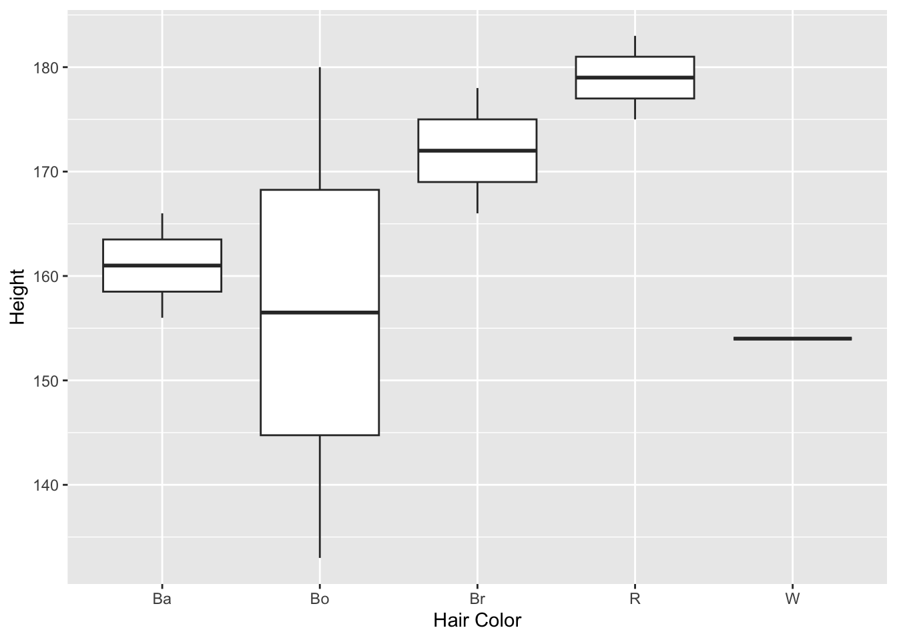

  
  
This Quarto file loads the cleaned data and does some exploring.

I'm only showing it the way where the code is included in the file. 
As described in the `processing_code` materials, I currently prefer the approach of having R code in a separate file and pulling it in.

But I already had this written and haven't yet re-done it that way. Feel free to redo and send a pull request on GitHub :)

Again, it is largely a matter of preference and what makes the most sense to decide if one wants to have code inside Quarto files, or as separate R files.
And sometimes, an R script with enough comments is good enough and one doesn't need a Quarto file.

Also note that while here I split cleaning and exploring, this is iterative. You saw that as part of the processing, we already had to explore the data somewhat to understand how to clean it. In general, as you explore, you'll find things that need cleaning. As you clean, you can explore more. Therefore, at times it might make more sense to combine the cleaning and exploring code parts into a single R or Quarto file. Or split things in any other logical way.

As part of the exploratory analysis, you should produce plots or tables or other summary quantities for the most interesting/important quantities in your data. Depending on the total number of variables in your dataset, explore all or some of the others. Figures produced here might be histograms or density plots, correlation plots, etc. Tables might summarize your data.

Start by exploring one variable at a time. Then continue by creating plots or tables of the outcome(s) of interest and the predictor/exposure/input variables you are most interested in. If your dataset is small, you can do that for all variables. 

Plots produced here can be scatterplots, boxplots, violinplots, etc. Tables can be simple 2x2 tables or larger ones.

# Setup


::: {.cell}

```{.r .cell-code}
#load needed packages. make sure they are installed.
library(here) #for data loading/saving
```

::: {.cell-output .cell-output-stderr}
```
here() starts at /Users/mutsa_n/Desktop/MADA-course/mutsanyamuranga-MADA-portfolio
```
:::

```{.r .cell-code}
library(dplyr)
```

::: {.cell-output .cell-output-stderr}
```

Attaching package: 'dplyr'
```
:::

::: {.cell-output .cell-output-stderr}
```
The following objects are masked from 'package:stats':

    filter, lag
```
:::

::: {.cell-output .cell-output-stderr}
```
The following objects are masked from 'package:base':

    intersect, setdiff, setequal, union
```
:::

```{.r .cell-code}
library(skimr)
library(ggplot2)
```
:::


Load the data.


::: {.cell}

```{.r .cell-code}
#Path to data. Note the use of the here() package and not absolute paths
data_location <- here::here("starter-analysis-exercise","data","processed-data","processeddata.rds")
#load data
mydata <- readRDS(data_location)
```
:::


# Data exploration through tables

Showing a bit of code to produce and save a summary table.


::: {.cell}

```{.r .cell-code}
summary_df = skimr::skim(mydata)
print(summary_df)
```

::: {.cell-output .cell-output-stdout}
```
── Data Summary ────────────────────────
                           Values
Name                       mydata
Number of rows             9     
Number of columns          5     
_______________________          
Column type frequency:           
  character                1     
  factor                   1     
  numeric                  3     
________________________         
Group variables            None  

── Variable type: character ────────────────────────────────────────────────────
  skim_variable n_missing complete_rate min max empty n_unique whitespace
1 Hair Color            0             1   1   2     0        5          0

── Variable type: factor ───────────────────────────────────────────────────────
  skim_variable n_missing complete_rate ordered n_unique top_counts      
1 Gender                0             1 FALSE          3 M: 4, F: 3, O: 2

── Variable type: numeric ──────────────────────────────────────────────────────
  skim_variable n_missing complete_rate  mean   sd  p0 p25 p50 p75 p100 hist 
1 Height                0             1 166.  16.0 133 156 166 178  183 ▂▁▃▃▇
2 Weight                0             1  70.1 21.2  45  55  70  80  110 ▇▂▃▂▂
3 Age                   0             1  33.7 15.4  18  23  32  39   69 ▇▃▃▁▂
```
:::

```{.r .cell-code}
# save to file
summarytable_file = here("starter-analysis-exercise","results", "tables-files", "summarytable.rds")
saveRDS(summary_df, file = summarytable_file)
```
:::


We are saving the results to the `results/tables` folder. Structure the folders inside `results` such that they make sense for your specific analysis. Provide enough documentation that someone can understand what you are doing and what goes where. `readme.md` files inside each folder are a good idea.


# Data exploration through figures

Histogram plots for the continuous outcomes. 

Height first.


::: {.cell}

```{.r .cell-code}
p1 <- mydata %>% ggplot(aes(x=Height)) + geom_histogram() 
plot(p1)
```

::: {.cell-output .cell-output-stderr}
```
`stat_bin()` using `bins = 30`. Pick better value with `binwidth`.
```
:::

::: {.cell-output-display}
{width=672}
:::

```{.r .cell-code}
figure_file = here("starter-analysis-exercise","results","figures","height-distribution.png")
ggsave(filename = figure_file, plot=p1) 
```

::: {.cell-output .cell-output-stderr}
```
Saving 7 x 5 in image
`stat_bin()` using `bins = 30`. Pick better value with `binwidth`.
```
:::
:::


Now weights.


::: {.cell}

```{.r .cell-code}
p2 <- mydata %>% ggplot(aes(x=Weight)) + geom_histogram() 
plot(p2)
```

::: {.cell-output .cell-output-stderr}
```
`stat_bin()` using `bins = 30`. Pick better value with `binwidth`.
```
:::

::: {.cell-output-display}
{width=672}
:::

```{.r .cell-code}
figure_file = here("starter-analysis-exercise","results","figures","weight-distribution.png")
ggsave(filename = figure_file, plot=p2) 
```

::: {.cell-output .cell-output-stderr}
```
Saving 7 x 5 in image
`stat_bin()` using `bins = 30`. Pick better value with `binwidth`.
```
:::
:::


Now height as function of weight.


::: {.cell}

```{.r .cell-code}
p3 <- mydata %>% ggplot(aes(x=Height, y=Weight)) + geom_point() + geom_smooth(method='lm')
plot(p3)
```

::: {.cell-output .cell-output-stderr}
```
`geom_smooth()` using formula = 'y ~ x'
```
:::

::: {.cell-output-display}
{width=672}
:::

```{.r .cell-code}
figure_file = here("starter-analysis-exercise","results","figures","height-weight.png")
ggsave(filename = figure_file, plot=p3) 
```

::: {.cell-output .cell-output-stderr}
```
Saving 7 x 5 in image
`geom_smooth()` using formula = 'y ~ x'
```
:::
:::


Once more height as function of weight, stratified by gender. Note that there is so little data, it's a bit silly. But we'll plot it anyway.


::: {.cell}

```{.r .cell-code}
p4 <- mydata %>% ggplot(aes(x=Height, y=Weight, color = Gender)) + geom_point() + geom_smooth(method='lm')
plot(p4)
```

::: {.cell-output .cell-output-stderr}
```
`geom_smooth()` using formula = 'y ~ x'
```
:::

::: {.cell-output .cell-output-stderr}
```
Warning in qt((1 - level)/2, df): NaNs produced
```
:::

::: {.cell-output .cell-output-stderr}
```
Warning in max(ids, na.rm = TRUE): no non-missing arguments to max; returning
-Inf
```
:::

::: {.cell-output-display}
{width=672}
:::

```{.r .cell-code}
figure_file = here("starter-analysis-exercise","results","figures","height-weight-stratified.png")
ggsave(filename = figure_file, plot=p4) 
```

::: {.cell-output .cell-output-stderr}
```
Saving 7 x 5 in image
`geom_smooth()` using formula = 'y ~ x'
```
:::

::: {.cell-output .cell-output-stderr}
```
Warning in qt((1 - level)/2, df): NaNs produced

Warning in qt((1 - level)/2, df): no non-missing arguments to max; returning
-Inf
```
:::
:::

The categorical category of "Hair color" on the X-Axis with "Height" on the Y-Axis in box-plot format.

::: {.cell}

```{.r .cell-code}
p5 <- mydata %>% ggplot(aes(x=`Hair Color`, y=Height)) + geom_boxplot()
plot(p5)
```

::: {.cell-output-display}
{width=672}
:::

```{.r .cell-code}
figure_file = here("starter-analysis-exercise","results","figures","categorical-hair_color-height.png")
ggsave(filename = figure_file, plot=p5) 
```

::: {.cell-output .cell-output-stderr}
```
Saving 7 x 5 in image
```
:::
:::

The categorical category of "Weight" on the X-Axis with "Age" on the Y-Axis in scatter plot.

::: {.cell}

```{.r .cell-code}
p6 <- mydata %>% ggplot(aes(x=`Weight`, y=Age)) + geom_point()
plot(p6)
```

::: {.cell-output-display}
{width=672}
:::

```{.r .cell-code}
figure_file = here("starter-analysis-exercise","results","figures","numerical-weight-age.png")
ggsave(filename = figure_file, plot=p6) 
```

::: {.cell-output .cell-output-stderr}
```
Saving 7 x 5 in image
```
:::
:::


# Notes

For your own explorations, tables and figures can be "quick and dirty". As long as you can see what's going on, there is no need to polish them. That's in contrast to figures you'll produce for your final products (paper, report, presentation, website, etc.). Those should look as nice, polished and easy to understand as possible.


